

  
  <h1 style={{ fontSize: '3.5rem', fontWeight: 'bold', background: 'linear-gradient(to right, #FF2D20, #4479A1)', WebkitBackgroundClip: 'text', WebkitTextFillColor: 'transparent' }}>🚗 MiraCar</h1>
  
Conectando talleres y clientes para una experiencia automotriz moderna, clara y eficiente.

  

    <a href="#sobre-miracar" style={{ textDecoration: 'none', color: '#FF2D20', fontWeight: 'bold', padding: '5px 10px', borderRadius: '5px', transition: 'all 0.3s ease' }}>¿Qué es MiraCar?</a>
    •
    <a href="#tecnologías-utilizadas" style={{ textDecoration: 'none', color: '#FF2D20', fontWeight: 'bold', padding: '5px 10px', borderRadius: '5px', transition: 'all 0.3s ease' }}>Tecnologías</a>
    •
    <a href="#instalación" style={{ textDecoration: 'none', color: '#FF2D20', fontWeight: 'bold', padding: '5px 10px', borderRadius: '5px', transition: 'all 0.3s ease' }}>Instalación</a>
    •
    <a href="#capturas-de-pantalla" style={{ textDecoration: 'none', color: '#FF2D20', fontWeight: 'bold', padding: '5px 10px', borderRadius: '5px', transition: 'all 0.3s ease' }}>Capturas</a>
    •
    <a href="#uso" style={{ textDecoration: 'none', color: '#FF2D20', fontWeight: 'bold', padding: '5px 10px', borderRadius: '5px', transition: 'all 0.3s ease' }}>Uso</a>
    •
    <a href="#estructura-del-proyecto" style={{ textDecoration: 'none', color: '#FF2D20', fontWeight: 'bold', padding: '5px 10px', borderRadius: '5px', transition: 'all 0.3s ease' }}>Estructura</a>
  

  

    
    
    
    
    
    
    
    
  

<h2 id="sobre-miracar" style={{ fontSize: '2.5rem', fontWeight: 'bold', color: '#FF2D20', textAlign: 'center', margin: '40px 0 20px' }}>❓ ¿Qué es MiraCar?</h2>

  
<strong>MiraCar</strong> es una aplicación web multiplataforma que conecta talleres automotrices con sus clientes, mejorando la comunicación, la gestión de reparaciones y la trazabilidad del historial de vehículos.

  
El sistema está diseñado para ser intuitivo, responsivo y adaptable a cualquier dispositivo (móvil, tablet, escritorio). Se orienta tanto a <strong>talleres</strong> que necesitan gestionar siniestros, clientes y documentación, como a <strong>usuarios</strong> que desean hacer seguimiento en tiempo real de sus vehículos.

<h2 id="tecnologías-utilizadas" style={{ fontSize: '2.5rem', fontWeight: 'bold', color: '#4479A1', textAlign: 'center', margin: '40px 0 20px' }}>🛠 Tecnologías Utilizadas</h2>

  
El proyecto fue desarrollado con las siguientes herramientas:

  <table style={{ width: '100%', borderCollapse: 'collapse', margin: '0 auto' }}>
    <thead>
      <tr style={{ background: '#f8f9fa' }}>
        <th style={{ padding: '12px 15px', textAlign: 'left', borderBottom: '2px solid #4479A1' }}>Herramienta</th>
        <th style={{ padding: '12px 15px', textAlign: 'left', borderBottom: '2px solid #4479A1' }}>Propósito</th>
      </tr>
    </thead>
    <tbody>
      <tr>
        <td style={{ padding: '12px 15px', borderBottom: '1px solid #ddd' }}><strong>Laravel 10</strong></td>
        <td style={{ padding: '12px 15px', borderBottom: '1px solid #ddd' }}>Framework backend (PHP)</td>
      </tr>
      <tr style={{ background: '#f8f9fa' }}>
        <td style={{ padding: '12px 15px', borderBottom: '1px solid #ddd' }}><strong>PHP 8.2</strong></td>
        <td style={{ padding: '12px 15px', borderBottom: '1px solid #ddd' }}>Lenguaje del servidor</td>
      </tr>
      <tr>
        <td style={{ padding: '12px 15px', borderBottom: '1px solid #ddd' }}><strong>MySQL</strong></td>
        <td style={{ padding: '12px 15px', borderBottom: '1px solid #ddd' }}>Base de datos relacional</td>
      </tr>
      <tr style={{ background: '#f8f9fa' }}>
        <td style={{ padding: '12px 15px', borderBottom: '1px solid #ddd' }}><strong>XAMPP</strong></td>
        <td style={{ padding: '12px 15px', borderBottom: '1px solid #ddd' }}>Entorno local (Apache + MySQL + PHP)</td>
      </tr>
      <tr>
        <td style={{ padding: '12px 15px', borderBottom: '1px solid #ddd' }}><strong>Composer</strong></td>
        <td style={{ padding: '12px 15px', borderBottom: '1px solid #ddd' }}>Gestión de dependencias PHP</td>
      </tr>
      <tr style={{ background: '#f8f9fa' }}>
        <td style={{ padding: '12px 15px', borderBottom: '1px solid #ddd' }}><strong>Node.js & npm</strong></td>
        <td style={{ padding: '12px 15px', borderBottom: '1px solid #ddd' }}>Gestión frontend, assets, dependencias JS</td>
      </tr>
      <tr>
        <td style={{ padding: '12px 15px', borderBottom: '1px solid #ddd' }}><strong>Bootstrap 5.3</strong></td>
        <td style={{ padding: '12px 15px', borderBottom: '1px solid #ddd' }}>Framework CSS responsivo</td>
      </tr>
      <tr style={{ background: '#f8f9fa' }}>
        <td style={{ padding: '12px 15px', borderBottom: '1px solid #ddd' }}><strong>Git</strong></td>
        <td style={{ padding: '12px 15px', borderBottom: '1px solid #ddd' }}>Control de versiones</td>
      </tr>
      <tr>
        <td style={{ padding: '12px 15px', borderBottom: '1px solid #ddd' }}><strong>Visual Studio Code</strong></td>
        <td style={{ padding: '12px 15px', borderBottom: '1px solid #ddd' }}>Editor de código recomendado</td>
      </tr>
    </tbody>
  </table>

  
Compatible con <strong>Windows, macOS y Linux</strong>.

<h2 id="instalación" style={{ fontSize: '2.5rem', fontWeight: 'bold', color: '#FF2D20', textAlign: 'center', margin: '40px 0 20px' }}>⚙️ Instalación</h2>

  <h3 style={{ fontSize: '1.8rem', color: '#333', marginBottom: '15px', textAlign: 'center' }}>Requisitos Previos</h3>

  

    PHP 8.1+
    MySQL 5.7+
    Node.js + npm
    Composer
    Git
    XAMPP o similar
  

  <h3 style={{ fontSize: '1.8rem', color: '#333', marginBottom: '15px', textAlign: 'center' }}>Pasos</h3>

  

    <pre style={{ margin: 0 }}>
      <code>
{`# Clonar el proyecto
git clone https://github.com/tuusuario/miracar.git
cd miracar

# Instalar dependencias backend
composer install

# Instalar dependencias frontend
npm install && npm run build

# Crear base de datos y configurar .env
cp .env.example .env
php artisan key:generate
php artisan migrate --seed

# Iniciar servidor local
php artisan serve`}
      </code>
    </pre>
  

<h2 id="capturas-de-pantalla" style={{ fontSize: '2.5rem', fontWeight: 'bold', color: '#4479A1', textAlign: 'center', margin: '40px 0 20px' }}>🖼️ Capturas de Pantalla</h2>

  <h3 style={{ fontSize: '2.2rem', fontWeight: 'bold', color: '#333', textAlign: 'center', margin: '30px 0 20px', borderBottom: '2px solid #4479A1', paddingBottom: '10px' }}>📂 General</h3>

  <h4 style={{ fontSize: '1.3rem', color: '#666', textAlign: 'center', margin: '20px 0 15px', fontWeight: 'normal' }}>🖥️ Monitor</h4>
  

    
    
  

  

    
    
    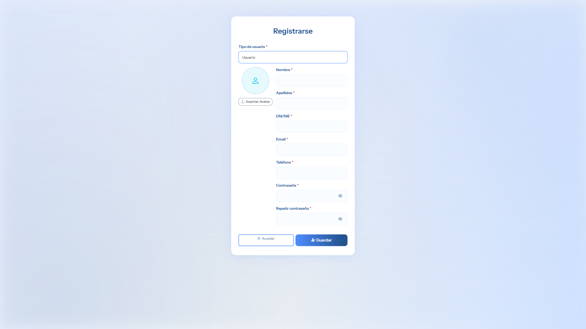
  

  <h4 style={{ fontSize: '1.3rem', color: '#666', textAlign: 'center', margin: '20px 0 15px', fontWeight: 'normal' }}>💻 Tablet</h4>
  

    
    
  

  

    
    
    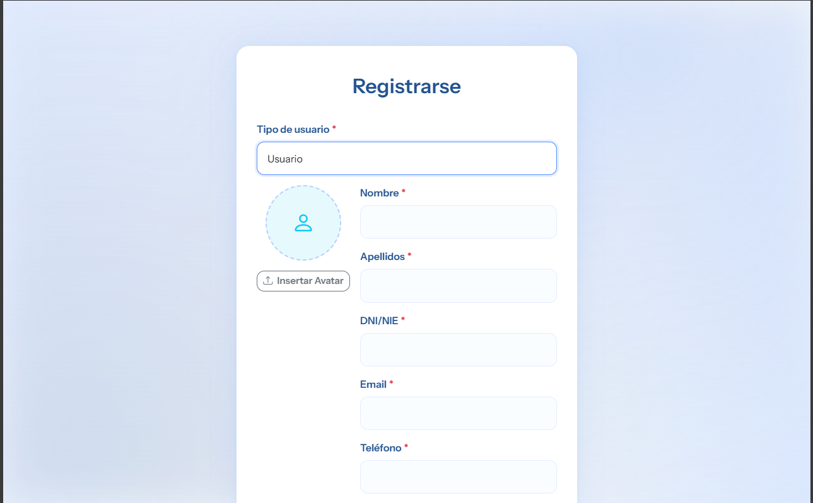
  

  <h4 style={{ fontSize: '1.3rem', color: '#666', textAlign: 'center', margin: '20px 0 15px', fontWeight: 'normal' }}>📱 Móvil</h4>
  

    
    
  

  

    
    
    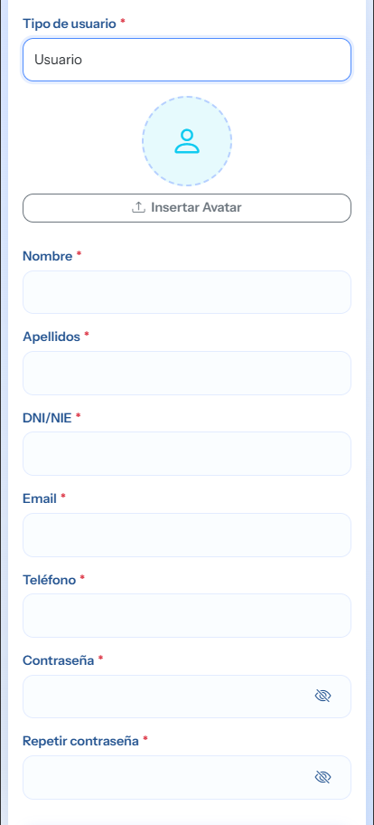
  

  <h3 style={{ fontSize: '2.2rem', fontWeight: 'bold', color: '#333', textAlign: 'center', margin: '50px 0 20px', borderBottom: '2px solid #FF2D20', paddingBottom: '10px' }}>🔧 Taller</h3>

  <h4 style={{ fontSize: '1.3rem', color: '#666', textAlign: 'center', margin: '20px 0 15px', fontWeight: 'normal' }}>🖥️ Monitor</h4>
  

    
    
    
    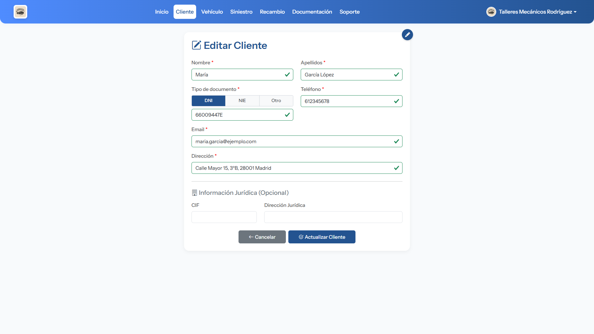
  

  

    
    
    
    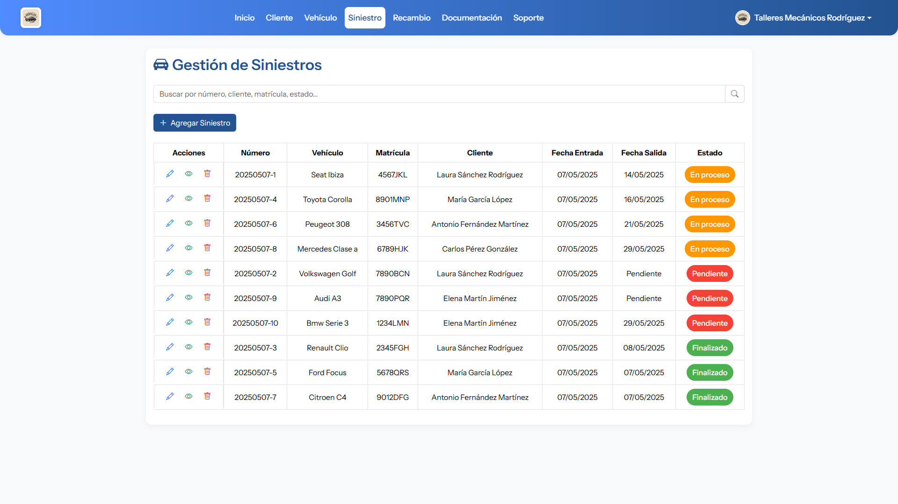
  

  

    
    
    
    
  

  <h4 style={{ fontSize: '1.3rem', color: '#666', textAlign: 'center', margin: '20px 0 15px', fontWeight: 'normal' }}>💻 Tablet</h4>
  

    
    
    
    
  

  

    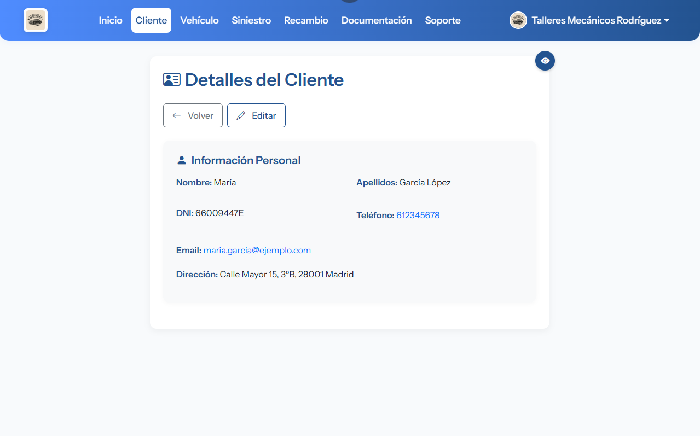
    
    
    
  

  

    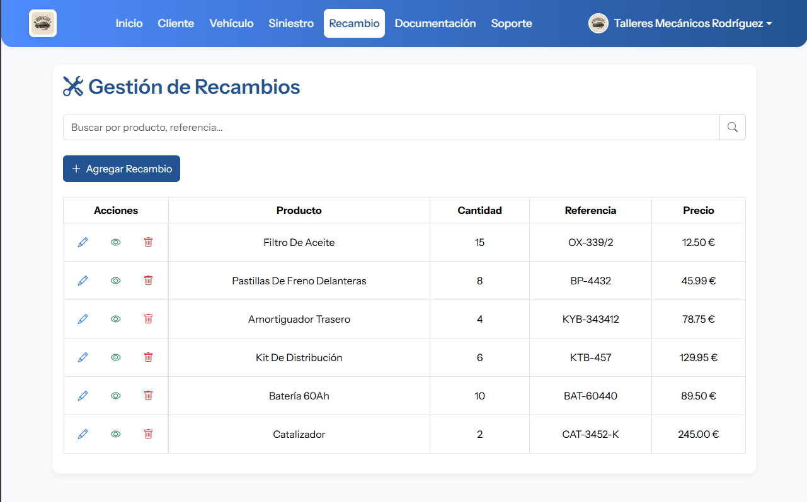
    
    
    
  

  <h4 style={{ fontSize: '1.3rem', color: '#666', textAlign: 'center', margin: '20px 0 15px', fontWeight: 'normal' }}>📱 Móvil</h4>
  

    
    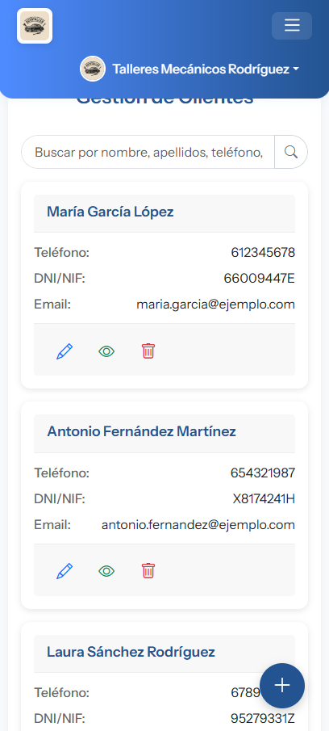
    
    
  

  

    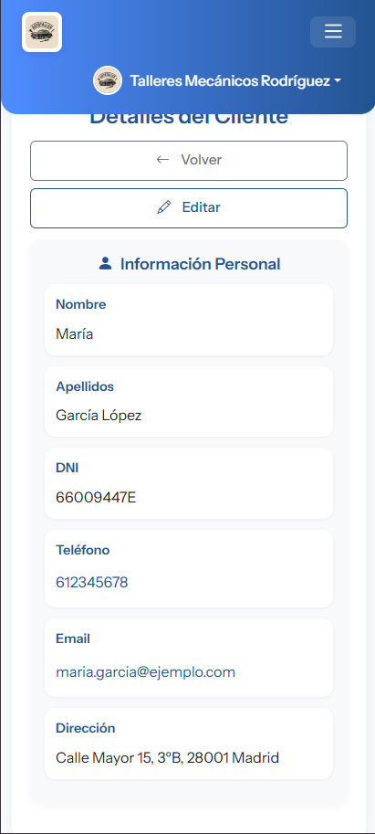
    
    
    
  

  

    
    
    
    
  

  <h3 style={{ fontSize: '2.2rem', fontWeight: 'bold', color: '#333', textAlign: 'center', margin: '50px 0 20px', borderBottom: '2px solid #4479A1', paddingBottom: '10px' }}>👤 Usuario</h3>

  <h4 style={{ fontSize: '1.3rem', color: '#666', textAlign: 'center', margin: '20px 0 15px', fontWeight: 'normal' }}>🖥️ Monitor</h4>
  

    
    
    
    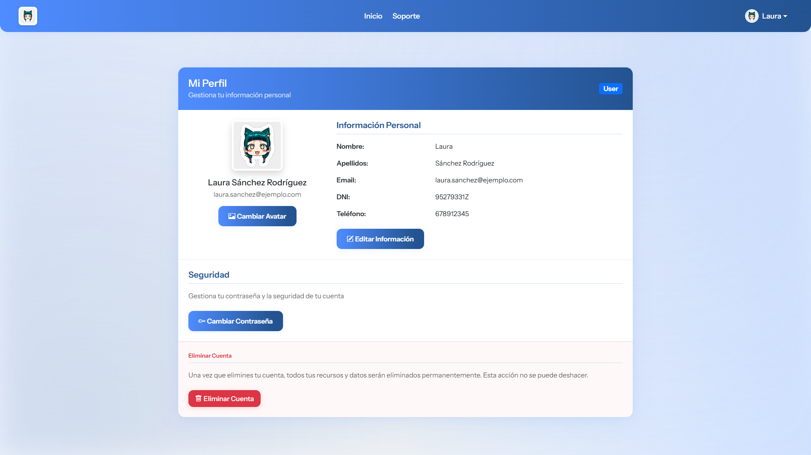
  

  <h4 style={{ fontSize: '1.3rem', color: '#666', textAlign: 'center', margin: '20px 0 15px', fontWeight: 'normal' }}>💻 Tablet</h4>
  

    
    
    
    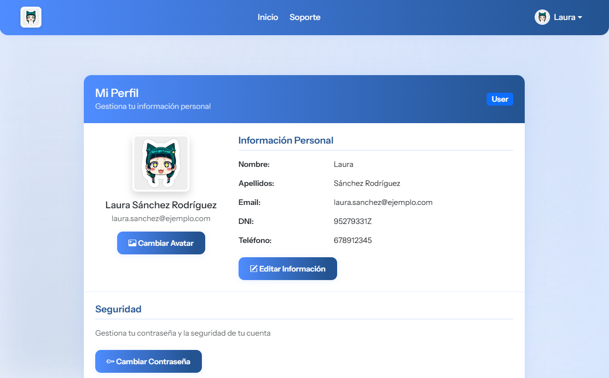
  

  <h4 style={{ fontSize: '1.3rem', color: '#666', textAlign: 'center', margin: '20px 0 15px', fontWeight: 'normal' }}>📱 Móvil</h4>
  

    
    
    
    
  

<h2 id="uso" style={{ fontSize: '2.5rem', fontWeight: 'bold', color: '#FF2D20', textAlign: 'center', margin: '40px 0 20px' }}>🚀 Uso del Programa</h2>

  

    

      <h3 style={{ fontSize: '1.8rem', color: '#333', marginBottom: '15px', borderLeft: '4px solid #FF2D20', paddingLeft: '10px' }}>Para el Taller:</h3>
      <ul style={{ listStyleType: 'none', padding: 0 }}>
        <li style={{ padding: '8px 0', display: 'flex', alignItems: 'center' }}>
          
          Registro de clientes, vehículos y partes de siniestro.
        </li>
        <li style={{ padding: '8px 0', display: 'flex', alignItems: 'center' }}>
          
          Gestión de documentos, fotos y piezas.
        </li>
        <li style={{ padding: '8px 0', display: 'flex', alignItems: 'center' }}>
          
          Control de estado de cada reparación paso a paso.
        </li>
        <li style={{ padding: '8px 0', display: 'flex', alignItems: 'center' }}>
          
          Comunicación directa con el cliente.
        </li>
      </ul>
    

    

      <h3 style={{ fontSize: '1.8rem', color: '#333', marginBottom: '15px', borderLeft: '4px solid #4479A1', paddingLeft: '10px' }}>Para el Usuario:</h3>
      <ul style={{ listStyleType: 'none', padding: 0 }}>
        <li style={{ padding: '8px 0', display: 'flex', alignItems: 'center' }}>
          
          Visualización del estado de reparación del vehículo.
        </li>
        <li style={{ padding: '8px 0', display: 'flex', alignItems: 'center' }}>
          
          Acceso a presupuestos, facturas y documentos.
        </li>
        <li style={{ padding: '8px 0', display: 'flex', alignItems: 'center' }}>
          
          Recepción de notificaciones del taller.
        </li>
      </ul>
    

  

<h2 id="licencia" style={{ fontSize: '2.5rem', fontWeight: 'bold', color: '#4479A1', textAlign: 'center', margin: '40px 0 20px' }}>📜 Licencia</h2>

  
Este proyecto está bajo la Licencia MIT. Revisa el archivo LICENSE para más información.

<h2 id="contacto" style={{ fontSize: '2.5rem', fontWeight: 'bold', color: '#FF2D20', textAlign: 'center', margin: '40px 0 20px' }}>✉️ Contacto</h2>

  
Proyecto desarrollado por <strong>Román Rodríguez Martín</strong>

  

    📧 Correo: <a href="mailto:adm.96.rrm@gmail.com" style={{ color: '#FF2D20', textDecoration: 'none' }}>adm.96.rrm@gmail.com</a>
  

  

    🌐 Sitio: <a href="" style={{ color: '#4479A1', textDecoration: 'none' }}>www.miracar.com</a> <em>(en construcción)</em>
  

