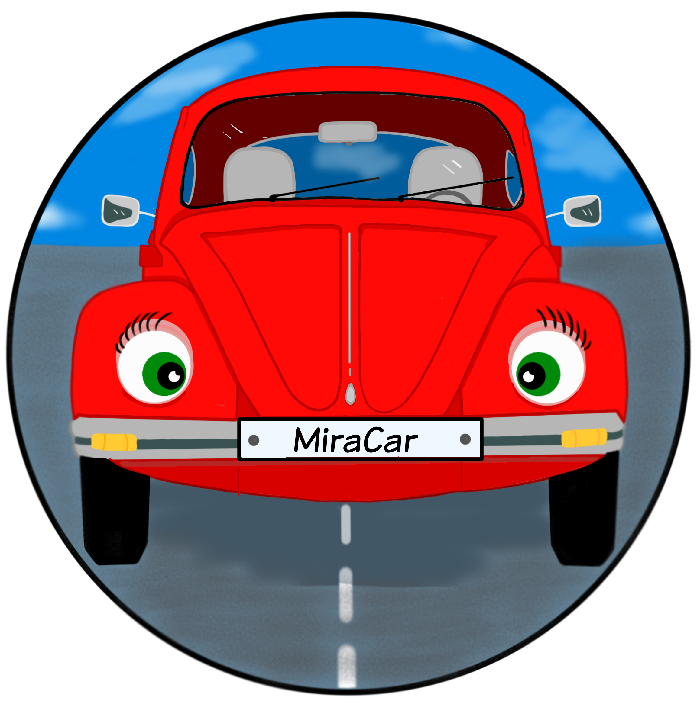

<div align="center">
  
  <h1>MiraCar</h1>
  <p>Conectando talleres y clientes para un servicio automotriz eficiente</p>
  
  <p>
    <a href="#características"><strong>Características</strong></a> •
    <a href="#tecnologías-utilizadas"><strong>Tecnologías</strong></a> •
    <a href="#instalación"><strong>Instalación</strong></a> •
    <a href="#capturas-de-pantalla"><strong>Capturas</strong></a> •
    <a href="#uso"><strong>Uso</strong></a> •
    <a href="#licencia"><strong>Licencia</strong></a>
  </p>
  
  <br>
  
  <p>
    
    
    
    
  </p>
</div>

## 📋 Índice

- [Sobre MiraCar](#sobre-miracar)
- [Características](#características)
- [Tecnologías Utilizadas](#tecnologías-utilizadas)
- [Instalación](#instalación)
- [Capturas de Pantalla](#capturas-de-pantalla)
  - [General](#general)
  - [Taller](#taller)
  - [Usuario](#usuario)
- [Uso](#uso)
- [Estructura del Proyecto](#estructura-del-proyecto)
- [Contribución](#contribución)
- [Licencia](#licencia)
- [Contacto](#contacto)

## 🚗 Sobre MiraCar

**MiraCar** es una plataforma web innovadora diseñada para transformar la relación entre talleres mecánicos y clientes. Nuestra aplicación facilita la gestión integral de servicios automotrices, desde el seguimiento de reparaciones hasta la documentación digital de vehículos.

La plataforma ofrece una experiencia fluida tanto para los talleres como para los usuarios finales, permitiendo una comunicación directa, transparencia en los procesos de reparación y un seguimiento detallado del historial de cada vehículo.

## ✨ Características

### Para Talleres

- **Gestión de Clientes**: Administración completa de la cartera de clientes con información detallada.
- **Control de Vehículos**: Registro y seguimiento de todos los vehículos atendidos.
- **Gestión de Siniestros**: Documentación y seguimiento de incidentes y reparaciones.
- **Inventario de Recambios**: Control de piezas y repuestos utilizados en reparaciones.
- **Documentación Digital**: Almacenamiento seguro de documentos relacionados con reparaciones.
- **Sistema de Soporte**: Canal directo para resolver dudas y problemas de los clientes.

### Para Usuarios

- **Historial de Vehículos**: Acceso completo al historial de mantenimiento y reparaciones.
- **Seguimiento de Reparaciones**: Monitoreo en tiempo real del estado de las reparaciones.
- **Comunicación Directa**: Canal de comunicación con el taller para consultas y actualizaciones.
- **Documentación Accesible**: Acceso a facturas, presupuestos y otros documentos importantes.
- **Notificaciones**: Alertas sobre el estado de reparaciones y mantenimientos programados.

## 🛠️ Tecnologías Utilizadas

MiraCar ha sido desarrollado utilizando un stack tecnológico moderno y robusto:

### Backend

- **[PHP 8.2](https://www.php.net/)**: Lenguaje de programación principal.
- **[Laravel 10](https://laravel.com/)**: Framework de desarrollo web.
- **[MySQL](https://www.mysql.com/)**: Sistema de gestión de bases de datos.
- **[Composer](https://getcomposer.org/)**: Gestor de dependencias para PHP.

### Frontend

- **[Bootstrap 5.3](https://getbootstrap.com/)**: Framework CSS para diseño responsivo.
- **[JavaScript](https://developer.mozilla.org/es/docs/Web/JavaScript)**: Para interactividad en el lado del cliente.
- **[Blade](https://laravel.com/docs/10.x/blade)**: Motor de plantillas de Laravel.
- **[Bootstrap Icons](https://icons.getbootstrap.com/)**: Biblioteca de iconos.

### Herramientas de Desarrollo

- **[XAMPP](https://www.apachefriends.org/)**: Entorno de desarrollo local (Apache, MySQL, PHP).
- **[Git](https://git-scm.com/)**: Control de versiones.
- **[Node.js](https://nodejs.org/)**: Entorno de ejecución para herramientas de frontend.
- **[npm](https://www.npmjs.com/)**: Gestor de paquetes para JavaScript.
- **[Visual Studio Code](https://code.visualstudio.com/)**: Editor de código recomendado.

### Entorno de Despliegue

- **Compatibilidad**: Windows, macOS, Linux.
- **Servidor Web**: Apache/Nginx.
- **Requisitos mínimos**: PHP 8.1+, MySQL 5.7+.

## 📥 Instalación

Sigue estos pasos para instalar y configurar MiraCar en tu entorno local:

### Prerrequisitos

- PHP 8.1 o superior
- Composer
- Node.js y npm
- XAMPP, WAMP, MAMP o similar (Apache y MySQL)
- Git

### Pasos de Instalación

1. **Clonar el repositorio**

```bash
git clone https://github.com/tuusuario/miracar.git
cd miracar